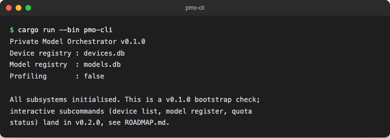

<div align="center">


# Private Model Orchestrator

</div>

[🇬🇧 English Version](README.md)

**Privacy-first Orchestrierung von Foundation Models für Apple-Geräteflotten.**

KI-Modelle auf Unternehmensebene verteilen, versionieren und bereitstellen. Daten verlassen das Gerät dabei nie.

[](https://github.com/9t29zhmwdh-coder/private-model-orchestrator/actions)      
[](https://securityscorecards.dev/viewer/?uri=github.com/9t29zhmwdh-coder/private-model-orchestrator)


> **So läuft das:** `pmo-cli` liest und schreibt eine lokale SQLite-Datenbank (standardmässig `pmo.db`) und beendet sich nach jedem Unterbefehl; es gibt keinen Installer und keinen Hintergrunddienst. `pmo-macos` (SwiftUI, siehe [pmo-macos/](pmo-macos/)) liest und schreibt seine eigene SQLite-Datenbank im Application-Support-Verzeichnis über dieselbe UniFFI-Bridge; CLI und App sehen dieselben Daten, wenn sie auf dieselbe Datenbankdatei zeigen.



---

> 💾 **Download:** [macOS (DMG)](https://github.com/9t29zhmwdh-coder/private-model-orchestrator/releases/latest): die verpackte `pmo-macos`-App, nicht codesigniert/notarisiert und noch nicht Sandboxed-App-Container-konform (siehe ROADMAP.md), Gatekeeper warnt beim ersten Start (Rechtsklick → Öffnen). `pmo-cli` ist nicht verpackt; aus dem Quellcode bauen, siehe Quickstart unten.

---

> 🌱 Neu hier? → [Schritt-für-Schritt-Anleitung für Einsteiger](GETTING_STARTED.md)

---

**In der Praxis:** Aktuell bekommst du eine getestete Rust-Bibliothek zur Modellierung von Geräteflotten, Modellbündeln, Kontingenten und MDM-Policy-Hinweisen, eine SQLite-gestützte Persistenzschicht, eine CLI mit `device`/`model`/`quota`-Unterbefehlen und eine SwiftUI-App (`pmo-macos`) mit echten Dashboard-Views (Geräte hinzufügen/entfernen, Gruppenzuweisung, Modellbündel, Kontingent-Nutzung pro Gerät mit Reset, MDM-Policy-Datei laden), alle über dieselbe SQLite-Speicherschicht via UniFFI angebunden. Die App ist als echtes `.app`-Bundle in einer DMG verpackt; eine notarisierte, Sandboxed-App-Container-konforme Version steht noch auf der Roadmap.

## Übersicht

Private Model Orchestrator (PMO) ist ein Enterprise-Toolkit zur Verwaltung von Foundation-Model-Deployments auf Apple-Geräteflotten. Alle Inferenzen laufen vollständig auf dem Gerät via Core ML; keine Telemetrie, kein Cloud-Egress.

## Funktionen

| Funktion | Beschreibung |
|----------|--------------|
| **AOT-Konvertierung** | Referenzpipeline für `.mlpackage` → `.mlmodelc` Ahead-of-Time-Kompilierung |
| **Modell-Packaging** | Versionierte, prüfsummenverifizierte Modellbündel mit Variant-Tracking |
| **Gerätegruppen** | Flottensegmentierung mit gruppenspezifischen Modellzuweisungen |
| **Quota-Management** | Gerätebezogene stündliche/tägliche Inferenz-Kontingente mit Reset |
| **MDM-Integration** | Configuration-Profile-Hinweise für Jamf / Apple Business Manager |
| **Performance-Profiling** | Instrumentierte Stubs für die Integration des Core ML Profilers |

## Schnellstart

```bash
# Build
cargo build --workspace

# CLI ausführen (zeigt eine Status-Zusammenfassung ohne Unterbefehl)
cargo run --bin pmo-cli

# Ein Gerät und ein Modellbündel registrieren, dann das Kontingent prüfen
cargo run --bin pmo-cli -- device register --serial C02XJ1ABCD12 --hardware-model "MacBookPro18,3" --os-version 14.5
cargo run --bin pmo-cli -- device list
cargo run --bin pmo-cli -- model register --name mistral-7b --version 0.1.0 --variant ml-model-c --checksum abc123
cargo run --bin pmo-cli -- quota status --device <geraete-id-aus-der-liste-oben>

# Tests
cargo test --workspace
```

Standardmässig liest und schreibt `pmo-cli` `pmo.db` im aktuellen Verzeichnis; mit `--db <pfad>` kann ein anderer Ort angegeben werden.

## Deinstallation / Datenbereinigung

Lösche das `target/` Build-Verzeichnis und die SQLite-Datei `pmo.db` (bzw. den Pfad, den du bei `--db` angegeben hast).

## Dokumentation

- [Architektur](ARCHITECTURE.md)
- [MDM-Integrationshandbuch](docs/mdm_integration.md)
- [AOT-Konvertierungsreferenz](docs/aot_conversion.md)
- [API-Referenz](docs/api_reference.md)
- [Roadmap](ROADMAP.md)
- [Datenschutzrichtlinie](PRIVACY.md)

## Voraussetzungen

- Rust 1.78+
- macOS 14+ (für Core ML AOT-Funktionen)
- Jamf Pro oder Apple Business Manager (optional, für MDM-Integration)

## Sicherheit

Siehe [SECURITY.md](SECURITY.md) für die Meldung von Sicherheitslücken.

## Mitwirken

Siehe [CONTRIBUTING.md](CONTRIBUTING.md).

---

**Autor:** [Rafael Yilmaz](https://github.com/9t29zhmwdh-coder) · **Status:** Active ·  · **Lizenz:** MIT
