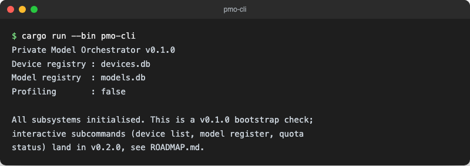

<div align="center">


# Private Model Orchestrator

</div>

[🇬🇧 English Version](README.md)

**Ein Register für eine Mac-Flotte: welches Gerät, welche Modellversion, welches Inferenz-Kontingent, an einem Ort festgehalten.**

Ein lokales Modell auf einem Rechner zu installieren ist ein Download. Über eine
Flotte hinweg stellen sich Fragen, die ein Download nicht beantwortet: welche
Geräte hängen noch auf der alten Version, wer darf wie viele Inferenzaufrufe
machen, was soll eigentlich wo laufen. PMO ist der Ort, an dem diese Antworten
festgehalten werden.

```
pmo-cli device list              was da draussen ist
pmo-cli model register           ein Modell-Bundle mit Version aufnehmen
pmo-cli quota …                  wer wie viel laufen lassen darf
```

Geräte, Modell-Bundles und Kontingente trägst du selbst ein, per CLI oder
Mac-App. PMO findet keine Geräte von selbst, installiert oder verteilt keine
Modelle und führt keine Inferenz aus: Es ist die Aufzeichnung, nicht die
Auslieferung. Nichts verlässt den Rechner, auf dem es läuft.

**Nichts für dich, wenn** du Modelle auf deinem eigenen Rechner betreibst. Dafür
sind Ollama oder llama.cpp da, und das hier legt eine Registry darüber, für die
du keine Verwendung hast. Und wenn Geräte melden sollen, was sie tatsächlich
fahren, oder Modelle verteilt werden sollen, ist das Aufgabe eines MDM wie Jamf
oder Intune; PMO hält nur den Sollzustand fest.

[](https://github.com/9t29zhmwdh-coder/private-model-orchestrator/actions) [](https://github.com/9t29zhmwdh-coder/private-model-orchestrator/security/code-scanning) [](https://securityscorecards.dev/viewer/?uri=github.com/9t29zhmwdh-coder/private-model-orchestrator) [](https://www.bestpractices.dev/projects/13687)

    


> **So läuft das:** `pmo-cli` liest und schreibt eine lokale SQLite-Datenbank (standardmässig `pmo.db`) und beendet sich nach jedem Unterbefehl; es gibt keinen Installer und keinen Hintergrunddienst. `pmo-macos` (SwiftUI, siehe [pmo-macos/](pmo-macos/)) liest und schreibt seine eigene SQLite-Datenbank im Application-Support-Verzeichnis über dieselbe UniFFI-Bridge; CLI und App sehen dieselben Daten, wenn sie auf dieselbe Datenbankdatei zeigen.



---

> 💾 **Download:** [macOS (DMG)](https://github.com/9t29zhmwdh-coder/private-model-orchestrator/releases/latest): die verpackte `pmo-macos`-App, nicht codesigniert/notarisiert und noch nicht Sandboxed-App-Container-konform (siehe ROADMAP.md), Gatekeeper warnt beim ersten Start (Rechtsklick → Öffnen). `pmo-cli` ist nicht verpackt; aus dem Quellcode bauen, siehe Quickstart unten.

---

> 🌱 Neu hier? → [Schritt-für-Schritt-Anleitung für Einsteiger](GETTING_STARTED.md)

---

**In der Praxis:** Aktuell bekommst du eine getestete Rust-Bibliothek zur Modellierung von Geräteflotten, Modellbündeln, Kontingenten und MDM-Policy-Hinweisen, eine SQLite-gestützte Persistenzschicht, eine CLI mit `device`/`model`/`quota`-Unterbefehlen und eine SwiftUI-App (`pmo-macos`) mit echten Dashboard-Views (Geräte hinzufügen/entfernen, Gruppenzuweisung, Modellbündel, Kontingent-Nutzung pro Gerät mit Reset, MDM-Policy-Datei laden), alle über dieselbe SQLite-Speicherschicht via UniFFI angebunden. Die App ist als echtes `.app`-Bundle in einer DMG verpackt; eine notarisierte, Sandboxed-App-Container-konforme Version steht noch auf der Roadmap.

## Übersicht

Private Model Orchestrator (PMO) ist eine Rust-Bibliothek mit CLI und
SwiftUI-Mac-App rund um eine SQLite-Datenbank. Sie hält die Geräte einer
Mac-Flotte fest, die dafür vorgesehenen Modell-Bundles und Inferenz-Kontingente
pro Gerät.

## Funktionen

| Funktion | Was sie tut |
|----------|-------------|
| **Geräteregister** | Geräte mit Seriennummer, Hardwaremodell und macOS-Version; hinzufügen, auflisten und entfernen in CLI und App |
| **Gerätegruppen** | Gruppen anlegen und Geräte zuordnen (Mac-App); die Bibliothek kann einer Gruppe auch Modell-Bundles zuweisen |
| **Modell-Bundles** | Name, Version, Variante (`.mlpackage` oder `.mlmodelc`) und eine von dir angegebene Prüfsumme; PMO speichert die Prüfsumme, prüft aber keine Dateien |
| **Kontingente** | Stündliche und tägliche Limits pro Gerät, ein Nutzungszähler und manuelles Zurücksetzen in der App; Inferenzen werden nicht automatisch gezählt |
| **Richtliniendatei** | Lädt in der App eine MDM-artige JSON-Richtlinie (minimale macOS-Version, erlaubte Modelle) und liest sie bei Änderungen neu ein |
| **Preflight-Skript** | `scripts/mdm_preflight.sh` gibt als JSON aus, ob ein Mac per MDM verwaltet wird, seine macOS-Version und ob `coremltools` installiert ist |

## Schnellstart

```bash
# Build
cargo build --workspace

# CLI ausführen (zeigt eine Status-Zusammenfassung ohne Unterbefehl)
cargo run --bin pmo-cli

# Ein Gerät und ein Modellbündel registrieren, dann das Kontingent prüfen
cargo run --bin pmo-cli -- device register --serial C02XJ1ABCD12 --hardware-model "MacBookPro18,3" --os-version 14.5
cargo run --bin pmo-cli -- device list
cargo run --bin pmo-cli -- model register --name mistral-7b --version 0.1.0 --variant ml-model-c --checksum abc123
cargo run --bin pmo-cli -- quota status --device <geraete-id-aus-der-liste-oben>

# Tests
cargo test --workspace
```

Standardmässig liest und schreibt `pmo-cli` `pmo.db` im aktuellen Verzeichnis; mit `--db <pfad>` kann ein anderer Ort angegeben werden.

## Deinstallation / Datenbereinigung

Lösche das `target/` Build-Verzeichnis und die SQLite-Datei `pmo.db` (bzw. den Pfad, den du bei `--db` angegeben hast).

## Dokumentation

- [Architektur](ARCHITECTURE.md)
- [MDM-Integrationshandbuch](docs/mdm_integration.md)
- [API-Referenz](docs/api_reference.md)
- [Roadmap](ROADMAP.md)
- [Datenschutzrichtlinie](PRIVACY.md)

## Voraussetzungen

- Rust 1.78+
- macOS 14+ für die Mac-App
- Jamf Pro oder Apple Business Manager (optional, für MDM-Integration)

## Sicherheit

Siehe [SECURITY.md](SECURITY.md) für die Meldung von Sicherheitslücken.

## Mitwirken

Siehe [CONTRIBUTING.md](CONTRIBUTING.md).

---

**Autor:** [Rafael Yilmaz](https://github.com/9t29zhmwdh-coder) · **Status:** Aktiv ·  · **Lizenz:** MIT
